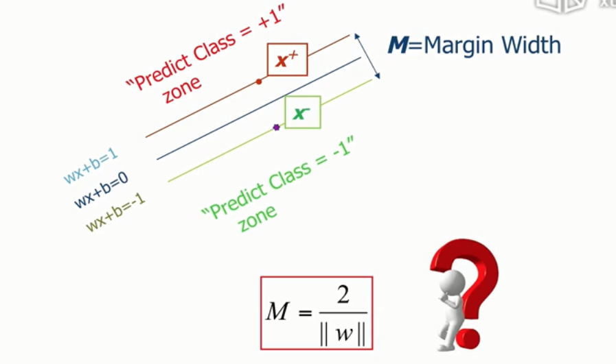

# SVM

## 基础知识

$\omega x+b=0$ 

$\omega =[\omega_1\quad\omega_2] $  $x=[x\quad y].T$   

点$x$到直线的距离=$g(x)=\lambda\omega·\omega$ 

表达式
$$
M=\frac{|g(x)|}{||\omega||}
$$

## margins 间隔

分隔线（面）可以移动的距离

## support vectors 支持向量

在margins线上的数据点

