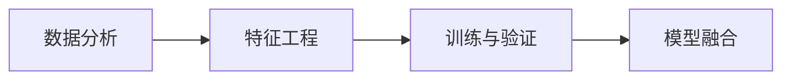

# 数据分析

**.jpg)**

**在数据竞赛流程上比较重要的一点是：你要知道你现在处于哪一个步骤，下一步应该做什么，还有哪些TODO和改进的地方。**

## 数据分析（Exploratory Data Analysis，探索性数据分析）

必须明确的几件事情：

1. 数据是如何**产生**的，数据又是如何**存储**的；
2. 数据是原始数据，还是经过人工处理(二次加工的)；
3. 数据由那些**业务背景**组成的，**数据字段**又有什么含义；
4. 数据字段是什么**类型**的，每个字段的**分布**是怎样的；
5. 训练集和测试集的数据分布是否有差异;

在分析数据的过程中，还必须要弄清楚的以下数据相关的问题：

1. 数据量是否充分，是否有**外部数据**可以进行补充；
2. 数据本身是否有噪音，是否需要进行**数据清洗**和**降维操作**；
3. 赛题的**评价函数**是什么，和数据字段有什么关系；
4. 数据字段与赛题标签的关系；

## 赛题背景分析

赛题背景分析包括一下细节：

1. 赛题业务场景是什么，数据是如何产生的，数据标签如何得来的？
2. 赛题任务是什么，具体要解决的问题是如何定义的；
3. 赛题任务是否有对应的学术任务？

**在赛题背景分析步骤中最重要的是分析赛题是什么任务，赛题任务是什么问题，历史是否有类似的赛题，学术上是否有对应的问题。**如果历史有类似的比赛/学术上对应的问题，那么直接copy解决方案来就OK了。

## 数据清洗

1. 对于类别变量，可以统计**比较少的取值**；
2. 对于数字变量，可以统计**特征的分布异常值**；
3. 统计字段的**缺失比例**；

## 特征预处理

1. 量纲归一化：标准化、区间放缩

2. 特征编码：

3. 1. 对于类别特征来说,有如下处理方式:

   2. 1. 自然数编码(Label Encoding)
      2. 独热编码(Onehot Encoding)
      3. 哈希编码(Hash Encoding)
      4. 统计编码(Count Encoding)
      5. 目标编码(Target Encoding)
      6. 嵌入编码(Embedding Encoding)
      7. 缺失值编码(NaN Encoding)
      8. 多项式编码(Polynomial Encoding)
      9. 布尔编码(Bool Encoding)

   3. 对于数值特征来说，有如下处理方式：

   4. 1. 取整(Rounding)
      2. 分箱(Binning)
      3. 放缩(Scaling)

4. 缺失值处理

5. 1. 用属性所有取值的**平均值**代替
   2. 用属性所有取值的**中位数**代替
   3. 用属性所有**出现次数最多的值**代替
   4. **丢弃**属性缺失的样本
   5. 让模型处理缺失值

## 特征工程

可以从一下几个角度构建新的特征：

1. 数据中每个字段的含义、分布、缺失情况；
2. 数据中每个字段的与赛题标签的关系；
3. 数据字段两两之间,或者三者之间的关系；