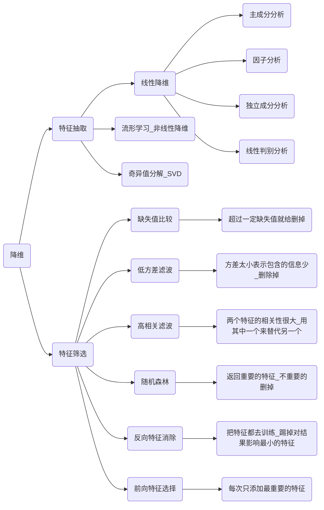

# 降维算法

### 意义：

- 多余的特征会影响或误导学习器
- 特征太多，参数也多，过拟合风险大
- 数据纬度可能虚高，真实纬度很小
- 纬度越少，训练越快，结果可能更好
- 降维可视化比较方便

### 降维的算法都有哪些

   

## PCA 

PCA的主要思想是将n维特征映射到k维上，这k维是全新的正交特征也被称为主成分，是在原有n维特征的基础上重新构造出来的k维特征。

**计算过程**：寻找数据的协方差矩阵的特征值和特征向量。其中前k大的特征值对应的特征向量就是映射矩阵，可以把当前的数据映射到k维空间，实现数据的降维。本质上是寻找方差最大的轴，映射到这个轴上。

**协方差矩阵** 的（i，j）项是第i个维度和第j个纬度的协方差。

**散度矩阵**：
$$
散度矩阵S=\sum_{k-1}^{n}(x_k-m)(x_k-m)^T \\
m=\frac{1}{n}\sum_{k=1}^{n}x_k
$$
散度矩阵和协方差矩阵的关系
$$
C=\frac{S}{n-1}
$$

## SVD（线性判别分析）

